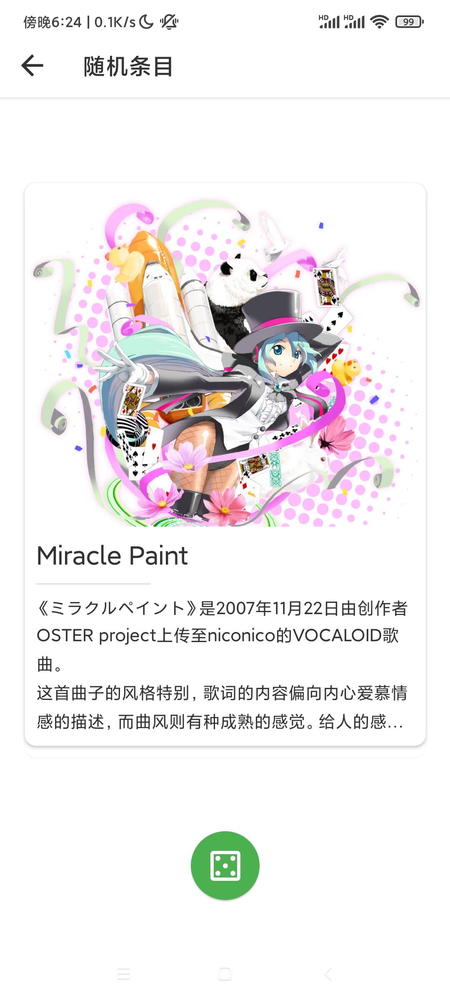
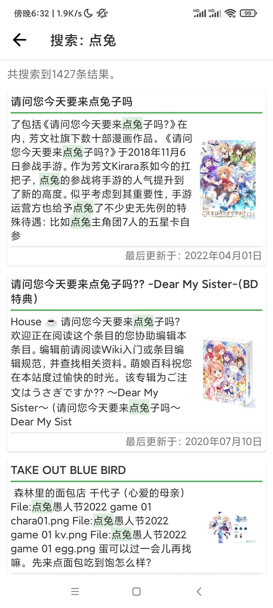
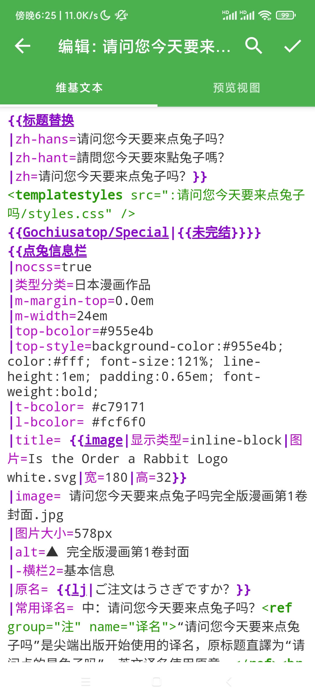
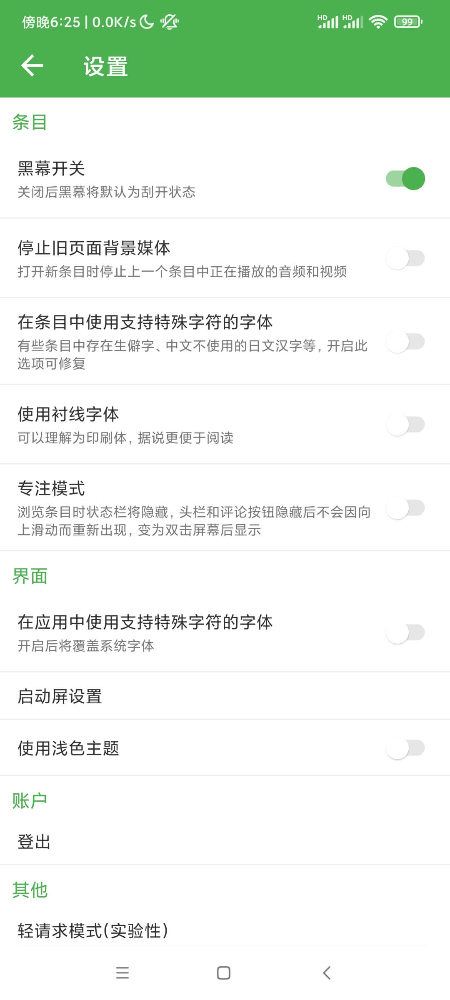
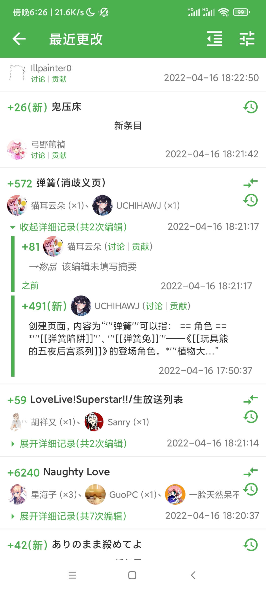
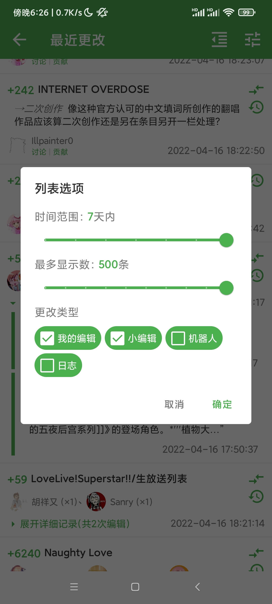
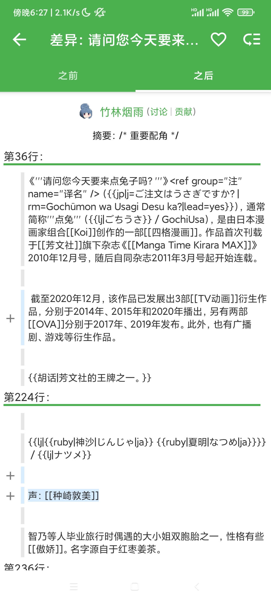

# Moegirl+ & HMoegirl

[萌娘百科，万物皆可萌的百科全书！](https://zh.moegirl.org/Mainpage)

[H萌娘，万物皆可H的百科全书！](https://www.hmoegirl.com/Mainpage)

该项目是萌娘百科与H萌娘的第三方安卓客户端，使用Jetpack Compose单Activity模式开发。

条目排版与渲染器：[moegirlRenderer](https://github.com/koharubiyori/moegirlRenderer)

## 下载

Moegirl+(萌娘百科)
> * Github Releases：https://github.com/koharubiyori/Moegirl-plus-native/releases
> * 酷安：https://www.coolapk.com/apk/247471
> * F-Droid：https://f-droid.org/packages/com.moegirlviewer

HMoegirl(H萌娘)
> * Github Releases：https://github.com/koharubiyori/Moegirl-plus-native/releases
> * F-Droid：https://f-droid.org/packages/koharubiyori.hmoegirl

## 功能简介

* 适配移动端，提供良好的阅读体验
* 完整的评论系统
* 提供简便的编辑及预览功能
* 最近更改，监视列表，页面历史及差异对比
* 条目搜索，分类浏览
* 浏览历史
* 夜间模式
* 简繁中文支持

## 截图

